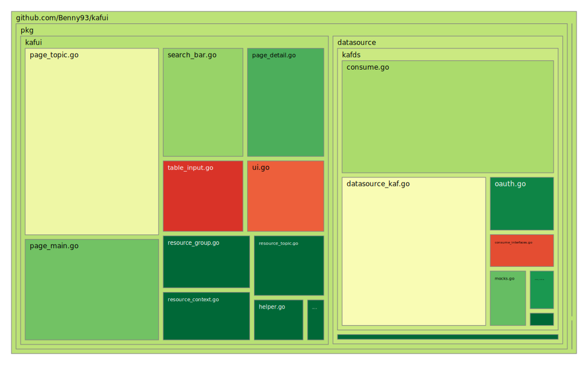

# Kafui

A k9s inspired terminal ui for [kaf](https://github.com/birdayz/kaf)  
It uses the same configuration file as kaf so you can use your existing kaf configuration to browse between kafkas.


## Usage

```bash
$ go run main.go -h
Explore different kafka broker in a k9s fashion with quick switches between topics, consumer groups and brokers

Usage:
  kafui [flags]

Flags:
      --config string   config file (default is $HOME/.kaf/config)
  -h, --help            help for kafui
      --mock            Enable mock mode: Display mock data to test various functions without a real kafka broker
```

## Install

### Winget

On windows you can install kafui using the following

```bash
winget install kafui
```

### Homebrew

If you're using Homebrew on macOS or Linux, you can easily install `kafui` using the following commands:

```bash
brew tap benny93/kafui
brew install kafui
```

This will tap into the `benny93/kafui` repository and install the `kafui` package on your system. 


### Downloader Script

Install via downloader script:

```bash
curl https://raw.githubusercontent.com/Benny93/kafui/main/godownloader.sh | BINDIR=$HOME/bin bash
```


### Go install

1. **Set Environment Variables (For Unix-like Systems):**

   Make sure you have the `GOPATH` environment variable set. Add the following lines to your shell configuration file (e.g., `~/.bashrc` for Bash, `~/.zshrc` for Zsh):

   ```bash
   echo 'export GOPATH=$(go env GOPATH)' >> ~/.bashrc
   echo 'export PATH="$PATH:$GOPATH/bin"' >> ~/.bashrc
   ```

   For Bash, use `~/.bash_profile` instead of `~/.bashrc`.

   For Zsh, use `~/.zshrc`.

   These commands ensure that the `GOPATH` and `GOPATH/bin` are added to your `PATH` environment variable, allowing you to execute Go binaries globally.

2. **Set Environment Variables (For Windows):**

   Open Command Prompt as an administrator and run the following commands:

   ```cmd
   setx GOPATH "%USERPROFILE%\go"
   setx PATH "%PATH%;%GOPATH%\bin"
   ```

   These commands set the `GOPATH` environment variable to `%USERPROFILE%\go` and add `%GOPATH%\bin` to the `PATH` environment variable, respectively. After running these commands, you might need to restart your Command Prompt session for the changes to take effect.

3. **Install via Go:**

   Once the environment variables are set, you can install the package using `go install`. Run the following command:

   ```bash
   go install github.com/Benny93/kafui@latest
   ```

   This command fetches the latest version of the `kafui` package from the specified GitHub repository and installs it in your `GOPATH/bin` directory. After installation, you can execute the `kafui` command from anywhere in your terminal.


## Configuration

First setup the config file at `$HOME/.kaf/config` using kaf
```bash
kaf config add-cluster local -b localhost:9092
```
replace `localhost:9092` with your broker.
If you use a schema registry open the config file and add the required configurations.
See [https://github.com/birdayz/kaf?tab=readme-ov-file#configuration](https://github.com/birdayz/kaf?tab=readme-ov-file#configuration)

Your configuration may look something like this:
```yaml
current-cluster: local
clusteroverride: ""
clusters:
- name: local
  version: ""
  brokers:
  - localhost:9092
  SASL: null
  TLS: null
  security-protocol: ""
  schema-registry-url: localhost:8085
  schema-registry-credentials: null
```

## Test coverage



> [Created with go-cover-treemap](https://github.com/nikolaydubina/go-cover-treemap)