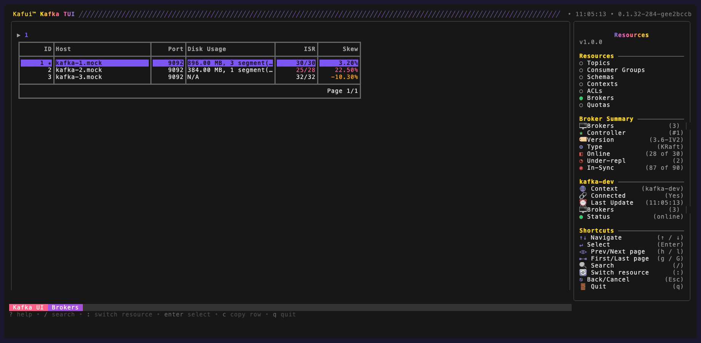
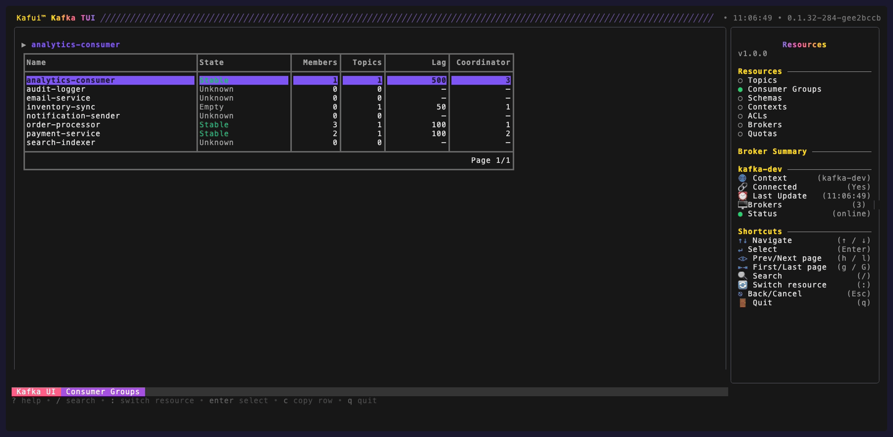
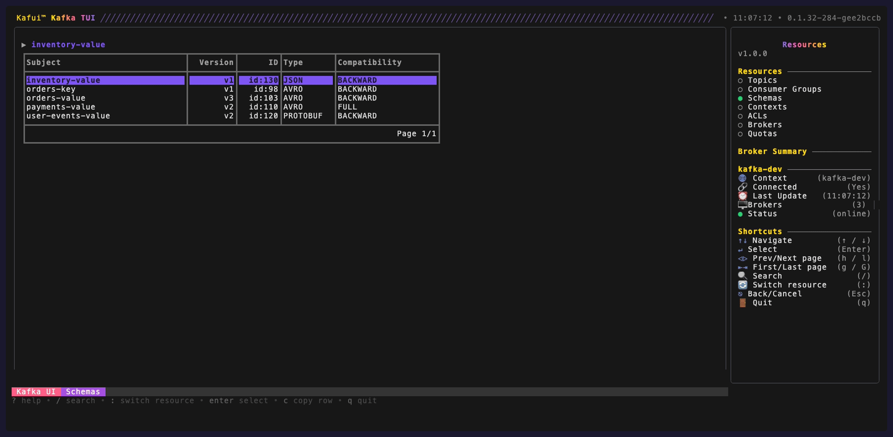
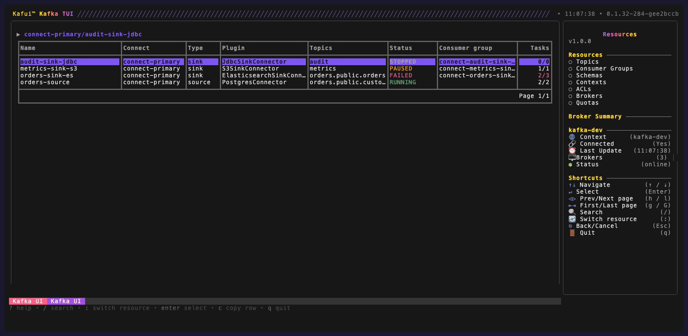
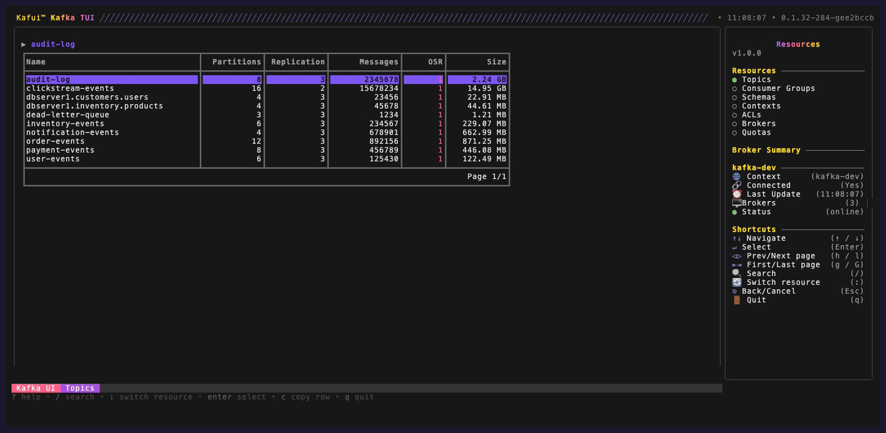
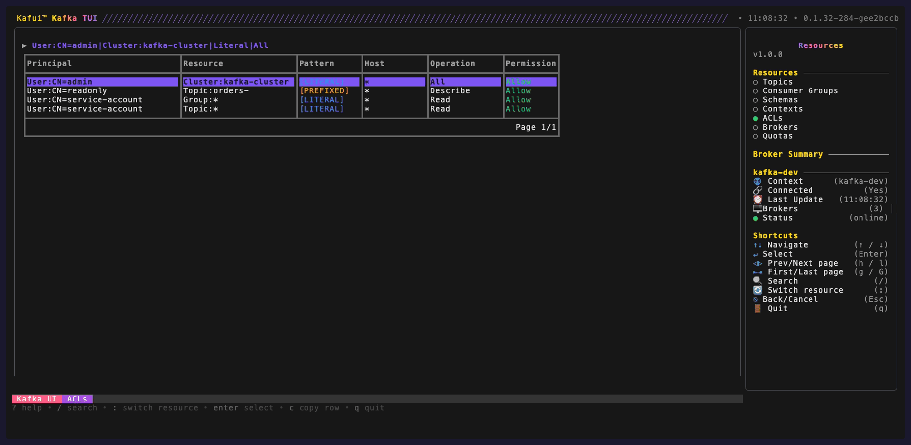
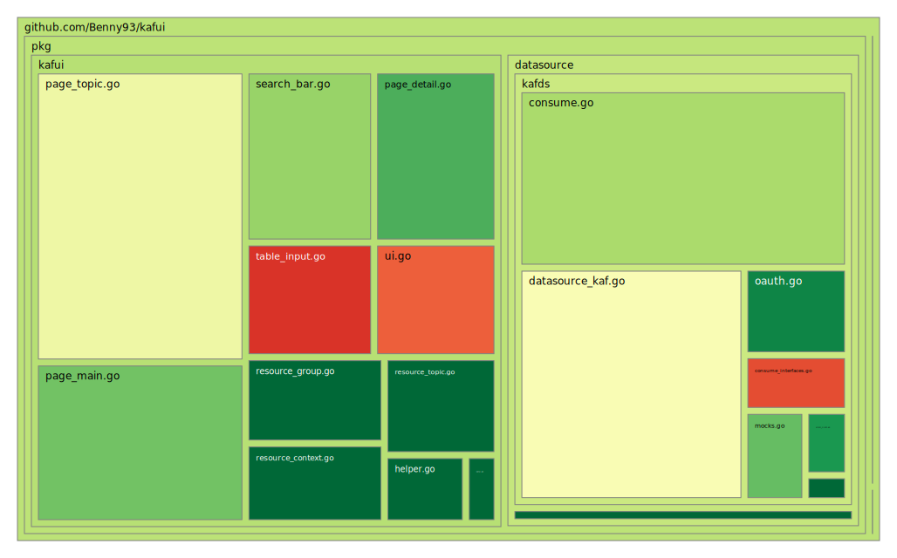

# Kafui

A k9s inspired terminal ui for [kaf](https://github.com/birdayz/kaf)  
It uses the same configuration file as kaf so you can use your existing kaf configuration to browse between kafkas.

## Features

All demos below run against the built-in mock data source (`kafui --mock`), so
you can reproduce every one of them without a broker. The `.tape` sources live
in [`vhs/`](./vhs) and are rendered with [VHS](https://github.com/charmbracelet/vhs)
(`vhs vhs/<feature>.tape`).

### Cluster management & dashboard

Multi-cluster overview with health status, version, broker/partition counts, an
offline-only filter, on-demand refresh (`r`), and connection validation (`v`).
Open it from anywhere with `C`.


### Broker management

Live broker list with per-broker stats and disk usage, plus a `broker:<id>`
detail page with Log Dirs / Configs / Metrics tabs (inline config editing and
replica log-dir reassignment behind confirmation).



### Topic management

Rich topic list (partitions, replication, out-of-sync replicas, on-disk size),
sorting, internal-topic visibility, CSV export, and create / clone / delete /
recreate / purge flows with confirmation.


### Message browsing & producing

Browse messages with full metadata, headers, and lazily decoded payloads;
seek by offset/timestamp, filter by partition or a smart-filter expression,
mask sensitive fields, export, produce, and reproduce a browsed message.


### Consumer groups & offsets

Group list enriched with state, members, topics, coordinator, and total lag,
plus a detail page with topic-grouped partition lag, auto-refresh, and reset /
delete flows.



### Schema registry

Browse subjects, versions, and schema content with syntax highlighting and a
side-by-side version diff; register new versions (with a compatibility check),
delete, and set compatibility — all behind confirmation.



### Kafka Connect

Connectors and connect clusters with live status, and a connector detail page
(Overview / Tasks / Config / Topics) with lifecycle actions — pause, resume,
stop, restart, delete, reset offsets — behind confirmation.



### Streaming SQL (ksqlDB)

Streams and tables overview and an interactive query editor that streams
`SELECT ... EMIT CHANGES` results row-by-row.



### ACLs & client quotas

ACL bindings with pattern types, resource/pattern filters, and create /
convenience forms (custom, or consumer/producer/stream expansion), plus CSV
export & declarative sync. A sibling client-quotas resource (`:quotas`) views
and edits quota entities.



### Metrics & monitoring

Live message/throughput rates with unicode sparklines from an in-process
history, an optional Prometheus query/graph surface, and an opt-in Prometheus
exposition endpoint (`--metrics-listen`). Open it with `ctrl+t`.


### Authentication, RBAC & audit

Per-cluster read-only mode (`--read-only`), local permission profiles enforced
at the datasource boundary, a JSONL audit log, and an effective-permissions
("whoami") view. Every mutating operation is gated and audited.


### Application configuration

A read-only view of the effective, merged configuration with secrets redacted,
build info, and per-cluster details (`ctrl+g`). A setup wizard (`ctrl+w`, gated
on `dynamicConfigEnabled`) adds, edits, and validates clusters.


### UI shell & cross-cutting UX

A consistent shell across every page: full help overlay (`?`), auto/dark/light
theming (`T`), a capability-filtered resource picker (`:`), confirmation
dialogs, notifications, deep-linking, and error pages.


## Usage

```bash
$ kafui --help
Explore different kafka broker in a k9s fashion with quick switches between topics, consumer groups and brokers

Usage:
  kafui [flags]
  kafui [command]

Available Commands:
  get         Non-interactive resource listings (machine-readable)
  health      Probe cluster (and schema registry) connectivity; exit 0 if healthy
  version     Print kafui version and build information

Flags:
  -b, --brokers strings          Comma-separated list of broker host:port pairs (overrides config)
  -c, --cluster string           Set the active cluster/context by name
      --config string            config file (default is $HOME/.kaf/config)
  -h, --help                     help for kafui
      --metrics-listen string    Serve the current metrics snapshot in Prometheus exposition format on this address (e.g. :9090); default off
      --mock                     Enable mock mode: Display mock data to test various functions without a real kafka broker
      --read-only                Treat every cluster as read-only: deny all altering operations
      --resource string          Open the main page pre-switched to a resource
      --schema-registry string   Schema registry URL (overrides config)
      --topic string             Open the given topic directly on startup
  -v, --verbose                  Enable verbose sarama logging
```

## Install

### Winget

On windows you can install kafui using the following

```bash
winget install kafui
```

### Homebrew

If you're using Homebrew on macOS or Linux, you can easily install `kafui` using the following commands:

```bash
brew tap benny93/kafui
brew install kafui
```

This will tap into the `benny93/kafui` repository and install the `kafui` package on your system. 


### Downloader Script

Install via downloader script:

```bash
curl https://raw.githubusercontent.com/Benny93/kafui/main/godownloader.sh | BINDIR=$HOME/bin bash
```


### Go install

1. **Set Environment Variables (For Unix-like Systems):**

   Make sure you have the `GOPATH` environment variable set. Add the following lines to your shell configuration file (e.g., `~/.bashrc` for Bash, `~/.zshrc` for Zsh):

   ```bash
   echo 'export GOPATH=$(go env GOPATH)' >> ~/.bashrc
   echo 'export PATH="$PATH:$GOPATH/bin"' >> ~/.bashrc
   ```

   For Bash, use `~/.bash_profile` instead of `~/.bashrc`.

   For Zsh, use `~/.zshrc`.

   These commands ensure that the `GOPATH` and `GOPATH/bin` are added to your `PATH` environment variable, allowing you to execute Go binaries globally.

2. **Set Environment Variables (For Windows):**

   Open Command Prompt as an administrator and run the following commands:

   ```cmd
   setx GOPATH "%USERPROFILE%\go"
   setx PATH "%PATH%;%GOPATH%\bin"
   ```

   These commands set the `GOPATH` environment variable to `%USERPROFILE%\go` and add `%GOPATH%\bin` to the `PATH` environment variable, respectively. After running these commands, you might need to restart your Command Prompt session for the changes to take effect.

3. **Install via Go:**

   Once the environment variables are set, you can install the package using `go install`. Run the following command:

   ```bash
   go install github.com/Benny93/kafui@latest
   ```

   This command fetches the latest version of the `kafui` package from the specified GitHub repository and installs it in your `GOPATH/bin` directory. After installation, you can execute the `kafui` command from anywhere in your terminal.


## Configuration

First setup the config file at `$HOME/.kaf/config` using kaf
```bash
kaf config add-cluster local -b localhost:9092
```
replace `localhost:9092` with your broker.
If you use a schema registry open the config file and add the required configurations.
See [https://github.com/birdayz/kaf?tab=readme-ov-file#configuration](https://github.com/birdayz/kaf?tab=readme-ov-file#configuration)

Your configuration may look something like this:
```yaml
current-cluster: local
clusteroverride: ""
clusters:
- name: local
  version: ""
  brokers:
  - localhost:9092
  SASL: null
  TLS: null
  security-protocol: ""
  schema-registry-url: localhost:8085
  schema-registry-credentials: null
```

## Test coverage



> [Created with go-cover-treemap](https://github.com/nikolaydubina/go-cover-treemap)