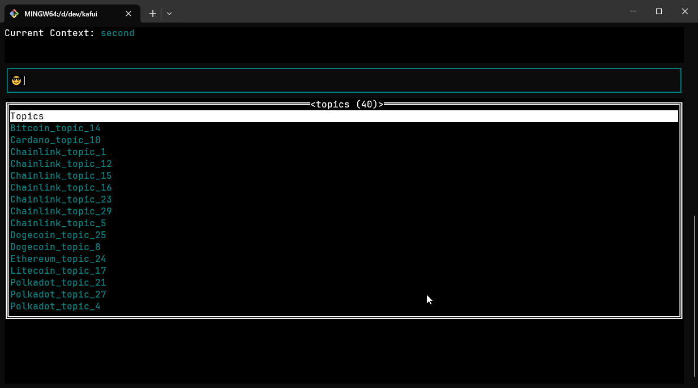
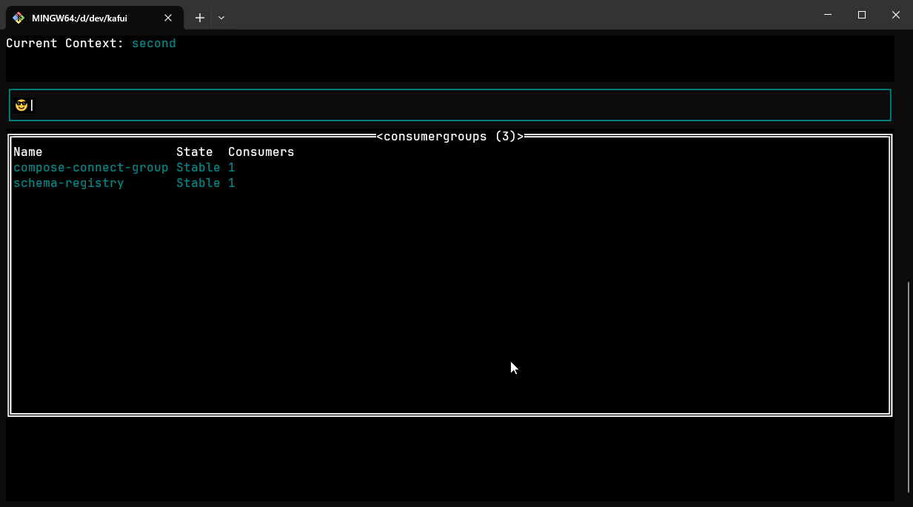
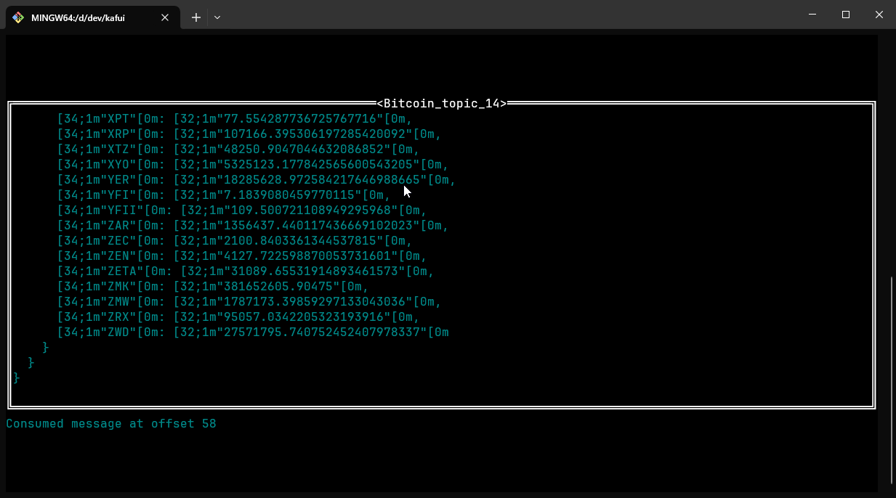

# Kafui

A k9s inspired terminal ui for [kaf](https://github.com/birdayz/kaf)

## Install

TODO...

## Run application through go
go run .\cmd\kafui\main.go

godownloader.sh | BINDIR=$HOME/bin bash
