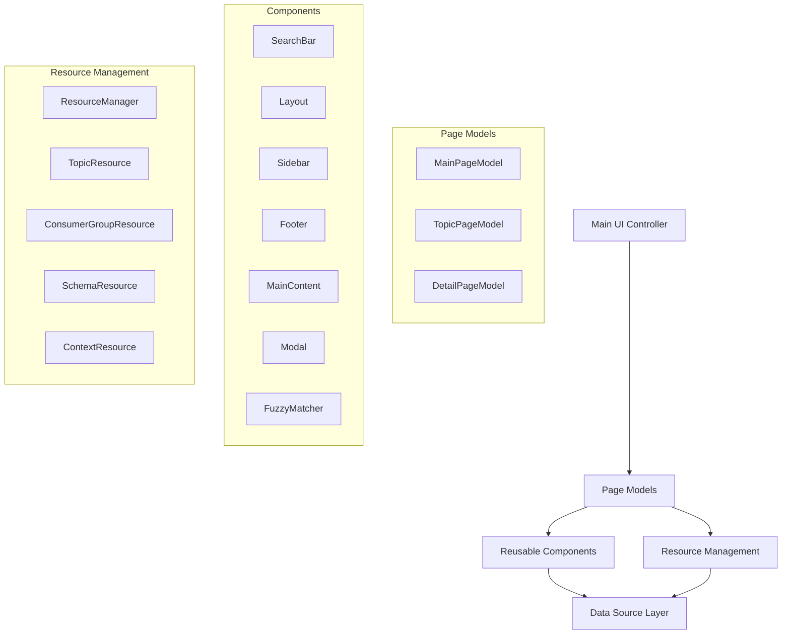
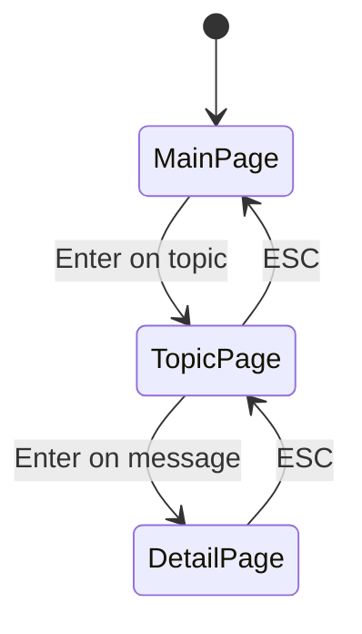
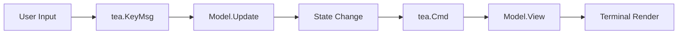
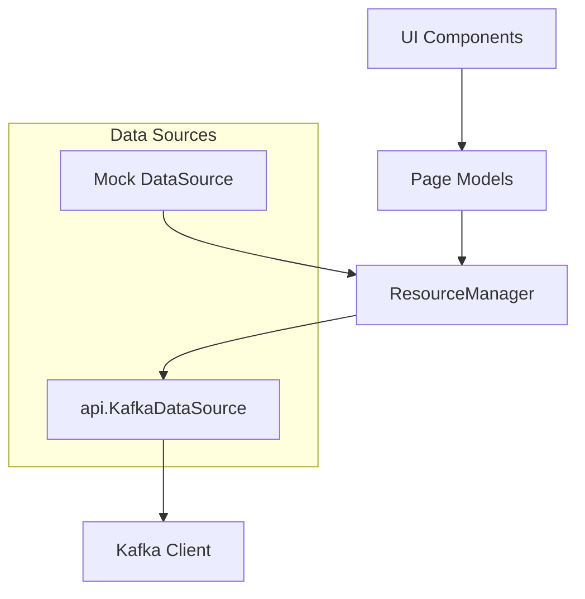

# Kafui UI Architecture Documentation

## Overview

Kafui's user interface is built using the **Bubble Tea framework** (by Charm), following a reactive, event-driven architecture. The UI provides an interactive terminal-based interface for managing Apache Kafka clusters, topics, consumer groups, and messages.

**Key Technologies:**
- **TUI Framework**: `github.com/charmbracelet/bubbletea` (v1.3.6) - Event-driven reactive UI
- **Styling**: `github.com/charmbracelet/lipgloss` - Terminal styling and layout
- **Components**: `github.com/charmbracelet/bubbles` - Pre-built UI components (tables, text input, lists, etc.)
- **UI Components**: Custom component system in `pkg/ui/components/`

## Architecture Pattern

The UI follows a **layered MVC-style architecture** with clear separation between presentation, business logic, and data access:



## Core Architecture Components

### 1. Main UI Controller (`ui.go`)

**Responsibility**: Root application state management and page routing

```go
type Model struct {
    dataSource  api.KafkaDataSource
    currentPage page
    mainPage    *MainPageModel
    topicPage   *TopicPageModel
    detailPage  *DetailPageModel
    width       int
    height      int
}
```

**Key Features:**
- **Page Navigation**: Manages transitions between main, topic, and detail pages
- **State Management**: Maintains global application state
- **Event Routing**: Delegates events to appropriate page models
- **Window Management**: Handles window size changes and propagates to child components
- **Lifecycle Management**: Initializes and cleans up page models

**Navigation Flow:**


**Key Methods:**
- `Init() tea.Cmd` - Initializes the application
- `Update(msg tea.Msg) (tea.Model, tea.Cmd)` - Handles all application events
- `View() string` - Routes rendering to appropriate page

### 2. Page Models

#### MainPageModel (`page_main.go`)

**Responsibility**: Primary interface for browsing Kafka resources

```go
type MainPageModel struct {
    // Data Management
    dataSource      api.KafkaDataSource
    resourceManager *ResourceManager
    currentResource Resource
    
    // UI Components
    topicList       list.Model
    searchBar       components.SearchBarModel
    layout          *components.Layout
    sidebar         *components.Sidebar
    footer          *components.Footer
    mainContent     *components.MainContent
    
    // State Management
    loading         bool
    searchMode      bool
    allItems        []list.Item
}
```

**Key Features:**
- **Resource Switching**: Dynamic switching between Topics, Consumer Groups, Schemas, Contexts
- **Search Integration**: Advanced search with fuzzy matching and suggestions
- **Modular Components**: Uses reusable layout components
- **Real-time Updates**: Periodic data refresh with loading states
- **Custom List Delegate**: Provides formatted display of resource items

#### TopicPageModel (`page_topic.go`)

**Responsibility**: Message consumption and display for specific Kafka topics

```go
type TopicPageModel struct {
    // Kafka Integration
    dataSource        api.KafkaDataSource
    topicName         string
    topicDetails      api.Topic
    consumeFlags      api.ConsumeFlags
    messages          []api.Message
    
    // UI Components
    messageTable      table.Model
    searchInput       textinput.Model
    
    // Real-time Features
    consuming         bool
    paused            bool
    cancelConsumption context.CancelFunc
    msgChan           <-chan api.Message
    errChan           <-chan error
    
    // Error Handling
    retryCount        int
    maxRetries        int
    retryDelay        time.Duration
    errorHistory      []error
    connectionStatus  string
}
```

**Key Features:**
- **Real-time Consumption**: Continuous message streaming from Kafka
- **Error Recovery**: Automatic retry logic with exponential backoff
- **Message Filtering**: Search and filter consumed messages
- **Pause/Resume**: Control message consumption flow
- **Connection Status**: Monitoring and display of connection health

#### DetailPageModel (`page_detail.go`)

**Responsibility**: Detailed view of individual Kafka messages

```go
type DetailPageModel struct {
    message      api.Message
    topicName    string
    width        int
    height       int
    viewport     viewport.Model
    metadata     string
    helpText     string
    wrapped      bool
}
```

**Key Features:**
- **JSON Formatting**: Syntax-highlighted JSON display
- **Scrollable Content**: Viewport for large message content
- **Metadata Display**: Message headers, offset, partition info
- **Word Wrapping**: Toggle text wrapping for readability
- **Navigation**: Scroll controls and keyboard shortcuts

### 3. Component System (`components/`)

The component system follows a **composition-over-inheritance** pattern with functional options:

```go
type ComponentOption func(*Component)

func NewComponent(options ...ComponentOption) Component {
    // Apply options pattern for flexible configuration
}
```

#### Layout Component (`components/layout.go`)

**Responsive Layout System:**
```go
type LayoutConfig struct {
    Width         int
    Height        int
    SidebarWidth  int
    ShowSidebar   bool
    HeaderTitle   string
    ResourceType  string
}
```

**Key Features:**
- **Flexible Dimensions**: Automatic calculation of content areas
- **Sidebar Integration**: Optional sidebar with configurable width
- **Header/Footer Management**: Consistent header and footer rendering
- **Responsive Design**: Adapts to terminal size changes

**Methods:**
- `CalculateDimensions()` - Calculates layout dimensions
- `RenderHeader()` - Renders application header with resource indicators
- `CombineMainContent()` - Combines main content with sidebar
- `RenderComplete()` - Complete layout rendering

#### SearchBar Component (`components/search_bar.go`)

**Advanced Search Features:**
```go
type SearchBarModel struct {
    textInput         textinput.Model
    searchHistory     []string
    resourceHistory   []string
    searchMode        SearchMode
    searchSuggestions []string
    fuzzyMatcher      *FuzzyMatcher
    onSearch          func(query string) tea.Msg
    onResourceSwitch  func(resource string) tea.Msg
}
```

**Search Modes:**
- **Simple Search**: Basic text matching
- **Advanced Search**: Complex queries with operators
- **Regex Search**: Regular expression patterns
- **Resource Search**: Resource type switching mode

**Key Features:**
- **Multi-mode Search**: Different search strategies
- **Fuzzy Matching**: Built-in fuzzy search with configurable sensitivity
- **Auto-suggestions**: Dynamic suggestions based on available data
- **Search History**: Maintains search history with navigation
- **Resource Switching**: Seamless switching between resource types

#### Sidebar Component (`components/sidebar.go`)

**Configurable Sidebar System:**
```go
type SidebarConfig struct {
    Context         string
    CurrentResource ResourceType
    ShowResources   bool
    ShowShortcuts   bool
    CustomSections  []SidebarSection
}
```

**Key Features:**
- **Context Display**: Shows current Kafka context
- **Resource Navigation**: Buttons for different resource types
- **Shortcuts Display**: Configurable keyboard shortcuts
- **Custom Sections**: Extensible content areas

#### Footer Component (`components/footer.go`)

**Smart Footer System:**
```go
type FooterConfig struct {
    Width         int
    SearchMode    bool
    SelectedItem  string
    TotalItems    int
    StatusMessage string
    LastUpdate    time.Time
    Spinner       spinner.Model
}
```

**Key Features:**
- **Mode-aware Rendering**: Different content for normal vs search mode
- **Status Information**: Selection info, counts, timing
- **Responsive Text**: Automatic text truncation for narrow screens
- **Spinner Integration**: Loading indicators

#### Additional Components

- **MainContent**: Manages the main content area with search integration
- **Modal**: Dialog system for confirmations and settings
- **FuzzyMatcher**: Advanced fuzzy matching engine

### 4. Resource Management System

#### Resource Abstraction

**Interface Design:**
```go
type Resource interface {
    GetType() ResourceType
    GetName() string
    GetHeaders() []string
    GetData() ([]ResourceItem, error)
    GetActions() []ResourceAction
}

type ResourceItem interface {
    GetID() string
    GetValues() []string
    GetDetails() map[string]string
}
```

**Resource Types:**
- `TopicResource`: Kafka topics with partition/replication info
- `ConsumerGroupResource`: Consumer groups with state/consumer info
- `SchemaResource`: Schema Registry schemas (extensible)
- `ContextResource`: Kafka cluster contexts (extensible)

#### ResourceManager

**Dynamic Resource Loading:**
```go
type ResourceManager struct {
    dataSource api.KafkaDataSource
    resources  map[ResourceType]Resource
}
```

**Key Features:**
- **Lazy Loading**: Resources loaded on-demand
- **Caching**: Intelligent caching with refresh capabilities
- **Extensibility**: Easy addition of new resource types
- **Type Safety**: Strongly typed resource management

### 5. Message System

**Bubble Tea Event System:**

The application uses Bubble Tea's event-driven architecture with custom message types:

```go
// Custom message types (messages.go)
type topicListMsg []list.Item
type errorMsg error
type pageChangeMsg page
type timerTickMsg time.Time

// Additional messages defined in various files
type searchTopicsMsg string
type switchResourceMsg ResourceType
type clearSearchMsg struct{}
```

**Message Flow:**


### 6. Data Flow Architecture

**Data Source Integration:**


**DataSource Interface:**
```go
type KafkaDataSource interface {
    GetTopics() (map[string]Topic, error)
    GetConsumerGroups() ([]ConsumerGroup, error)
    ConsumeMessages(topic string, flags ConsumeFlags) (<-chan Message, <-chan error, context.CancelFunc, error)
    GetContext() string
}
```

### 7. Styling System (`styles.go`)

**Centralized Style Management:**
```go
// Global color scheme
var (
    Subtle    = lipgloss.AdaptiveColor{Light: "#D9DCCF", Dark: "#383838"}
    Highlight = lipgloss.AdaptiveColor{Light: "#874BFD", Dark: "#7D56F4"}
    Special   = lipgloss.AdaptiveColor{Light: "#43BF6D", Dark: "#73F59F"}
    Info      = lipgloss.AdaptiveColor{Light: "#4A90E2", Dark: "#4A90E2"}
    Warning   = lipgloss.AdaptiveColor{Light: "#F5A623", Dark: "#F5A623"}
)

// Component styles
var (
    HeaderStyle       = lipgloss.NewStyle().Bold(true).Foreground(lipgloss.Color("#FFFFFF")).Background(Highlight)
    ResourceTypeStyle = lipgloss.NewStyle().Background(Info).Bold(true)
    TitleStyle        = lipgloss.NewStyle().Bold(true).Foreground(lipgloss.Color("#FFFFFF"))
)
```

**Key Features:**
- **Adaptive Colors**: Light/dark theme support
- **Consistent Styling**: Centralized style definitions
- **Component-specific Styles**: Specialized styling for different components
- **Border and Layout Styles**: Consistent visual hierarchy

## Error Handling & Recovery

### Multi-level Error Handling

**Application Level:**
```go
type errorMsg error

func (m Model) Update(msg tea.Msg) (tea.Model, tea.Cmd) {
    switch msg := msg.(type) {
    case errorMsg:
        m.statusMessage = fmt.Sprintf("Error: %v", msg)
        return m, nil
    }
}
```

**Connection Level:**
```go
type TopicPageModel struct {
    retryCount        int
    maxRetries        int
    retryDelay        time.Duration
    errorHistory      []error
    connectionStatus  string
}
```

**Recovery Strategies:**
- **Exponential Backoff**: Automatic retry with increasing delays
- **Circuit Breaker**: Prevent cascading failures
- **Graceful Degradation**: Show cached data when live data unavailable
- **User Feedback**: Clear error messages and recovery options

## Performance Considerations

### Rendering Optimization

- **Incremental Updates**: Only re-render changed components
- **Viewport Optimization**: Virtualized scrolling for large datasets
- **Debounced Search**: Prevent excessive filtering on fast typing
- **Component Isolation**: Independent component rendering

### Memory Management

- **Message Buffering**: Circular buffer for consumed messages
- **Component Cleanup**: Proper cleanup when switching pages
- **Connection Management**: Graceful cleanup of Kafka connections
- **Resource Pooling**: Efficient resource usage

### Asynchronous Operations

**Real-time Data Streaming:**
```go
// Message consumption with channels
msgChan, errChan, cancel, err := dataSource.ConsumeMessages(topic, flags)

// Handle in separate goroutine
go func() {
    for {
        select {
        case msg := <-msgChan:
            // Send to UI via Bubble Tea command
        case err := <-errChan:
            // Handle errors
        }
    }
}()
```

## Key Design Patterns

### 1. Model-View-Update (MVU)
- **Model**: Application state
- **View**: Pure rendering functions
- **Update**: Event handling and state transitions

### 2. Component Composition
- **Reusable Components**: Modular UI building blocks
- **Configuration Options**: Flexible component setup
- **Functional Options**: Type-safe configuration pattern

### 3. Resource Abstraction
- **Interface-based Design**: Common interface for all resource types
- **Dynamic Loading**: On-demand resource fetching
- **Extensible Architecture**: Easy addition of new resource types

### 4. Event-driven Architecture
- **Message Passing**: Bubble Tea's message system
- **Command Batching**: Efficient command execution
- **State Isolation**: Independent component state management

## Extension Points

### Adding New Resource Types

1. **Implement Resource Interface:**
```go
type NewResource struct {
    BaseResource
}

func (nr *NewResource) GetData() ([]ResourceItem, error) {
    // Implementation
}
```

2. **Register with ResourceManager:**
```go
func NewResourceManager(ds api.KafkaDataSource) *ResourceManager {
    rm := &ResourceManager{
        dataSource: ds,
        resources: map[ResourceType]Resource{
            NewResourceType: NewNewResource(ds),
        },
    }
}
```

### Adding New Pages

1. **Create Page Model:**
```go
type NewPageModel struct {
    // Page-specific state
}

func (m NewPageModel) Init() tea.Cmd { /* ... */ }
func (m NewPageModel) Update(msg tea.Msg) (tea.Model, tea.Cmd) { /* ... */ }
func (m NewPageModel) View() string { /* ... */ }
```

2. **Integrate with Main Controller:**
- Add page constant
- Update navigation logic
- Add page initialization

### Adding New Components

**Component Template:**
```go
type NewComponent struct {
    config NewComponentConfig
}

type NewComponentOption func(*NewComponent)

func NewNewComponent(options ...NewComponentOption) *NewComponent {
    // Implementation with options pattern
}
```

## Testing Architecture

### Testing Strategy

**Unit Tests:**
- Page model state transitions
- Component render logic
- Search functionality
- Resource management

**Integration Tests:**
- End-to-end user workflows
- Kafka integration scenarios
- Error recovery mechanisms

**Test Utilities:**
```go
// Mock data source for testing
type MockDataSource struct {
    topics map[string]api.Topic
    // ... other mock data
}
```

### Test Patterns

- **Render Testing**: Verify component output
- **State Testing**: Test model state transitions
- **Event Testing**: Test message handling
- **Integration Testing**: Test component interaction

## Best Practices

### Component Design
- **Single Responsibility**: Each component has one clear purpose
- **Composition**: Build complex UIs from simple, reusable components
- **Configuration**: Use options pattern for flexible component setup
- **State Isolation**: Components manage their own state when possible

### Event Handling
- **Message Types**: Use typed messages for type safety
- **Command Batching**: Batch multiple commands for efficiency
- **Error Propagation**: Consistent error handling across the application
- **Async Operations**: Use channels and goroutines for long-running operations

### Code Organization
- **Separation of Concerns**: Clear boundaries between UI, business logic, and data
- **Interface-based Design**: Use interfaces for testability and extensibility
- **Package Structure**: Logical grouping of related functionality
- **Documentation**: Comprehensive documentation of architecture and patterns

## Entry Points and Application Lifecycle

### Application Initialization (`kafui.go`)

```go
func Init(cfgOption string, useMock bool) {
    var dataSource api.KafkaDataSource
    dataSource = mock.KafkaDataSourceMock{}
    if !useMock {
        dataSource = kafds.NewKafkaDataSourceKaf()
    }
    dataSource.Init(cfgOption)
    openUIFunc(dataSource)
}

func OpenUI(dataSource api.KafkaDataSource) {
    p := tea.NewProgram(initialModel(dataSource), tea.WithAltScreen())
    if _, err := p.Run(); err != nil {
        fmt.Printf("Error running program: %v\n", err)
    }
}
```

### Lifecycle Flow
1. **Initialization**: Data source setup and configuration
2. **Model Creation**: Initial model with main page
3. **Program Start**: Bubble Tea program initialization
4. **Event Loop**: Continuous message processing
5. **Cleanup**: Resource cleanup on exit

This architecture provides a solid foundation for building interactive terminal applications with clean separation of concerns, reusable components, and extensible design patterns.