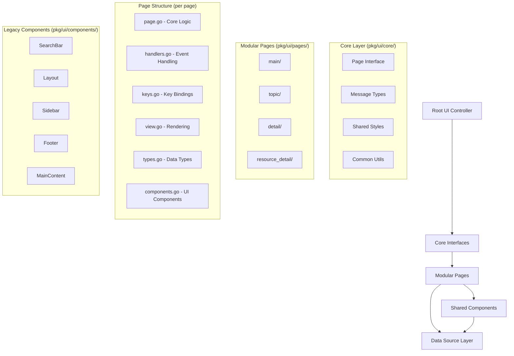
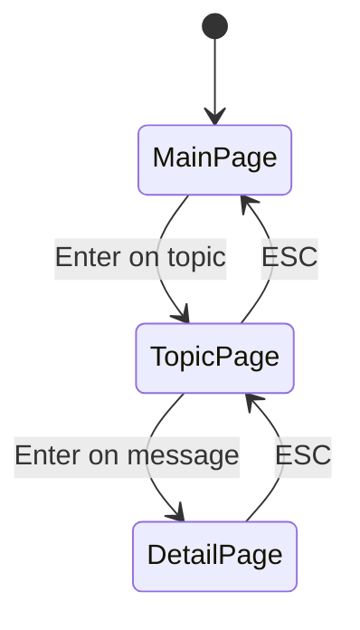
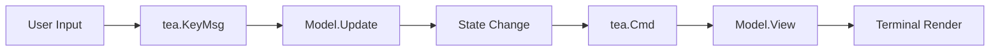
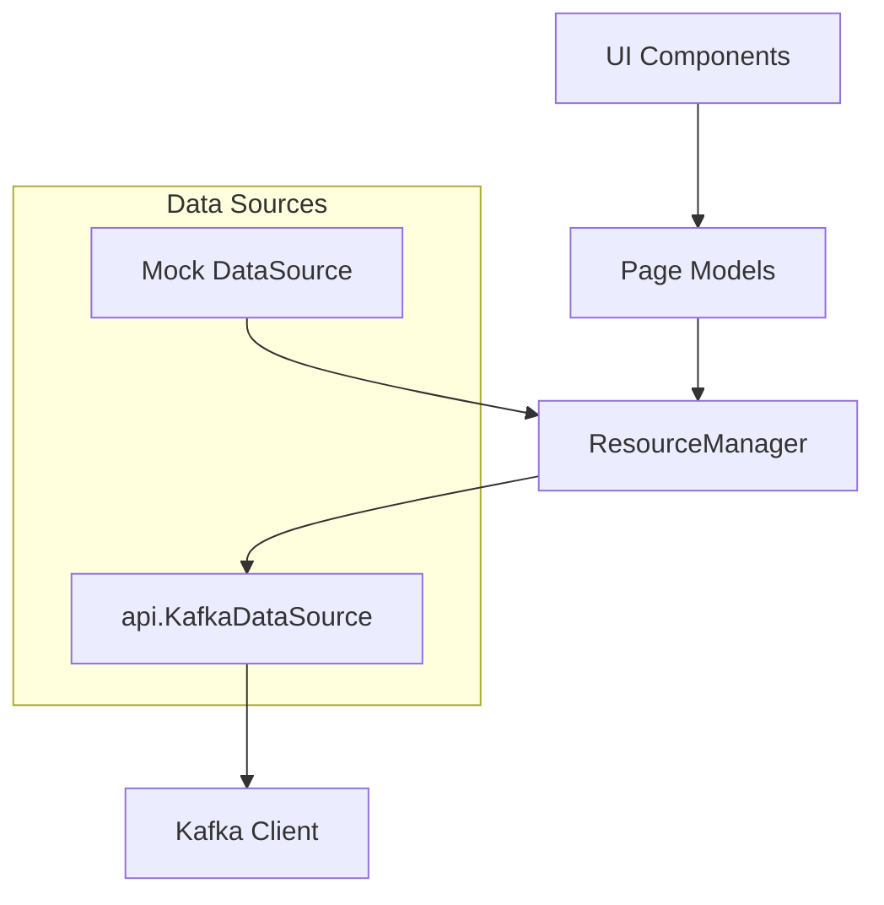

# Kafui UI Architecture Documentation

## Overview

Kafui's user interface is built using the **Bubble Tea framework** (by Charm), following a reactive, event-driven architecture with a **modular design pattern**. The UI has been restructured into a clean, maintainable architecture with separated concerns, reusable components, and a standardized page interface system.

**Key Technologies:**
- **TUI Framework**: `github.com/charmbracelet/bubbletea` (v1.3.6) - Event-driven reactive UI
- **Styling**: `github.com/charmbracelet/lipgloss` - Terminal styling and layout
- **Components**: `github.com/charmbracelet/bubbles` - Pre-built UI components (tables, text input, lists, etc.)
- **UI Components**: Custom component system in `pkg/ui/components/`
- **Modular Architecture**: Page-based modules in `pkg/ui/pages/` with separated concerns

## Architecture Pattern

The UI follows a **modular page-based architecture** with standardized interfaces and clear separation of concerns. Each page is implemented as a self-contained module with dedicated files for different responsibilities:



## Core Architecture Components

### 1. Core Interfaces (`pkg/ui/core/`)

**The foundation of the modular architecture providing standardized interfaces and shared utilities.**

#### Page Interface (`core/interfaces.go`)

**Standardized interface that all pages must implement:**

```go
type Page interface {
    Init() tea.Cmd
    Update(msg tea.Msg) (tea.Model, tea.Cmd)
    View() string
    SetDimensions(width, height int)
    GetID() string
}

type Dimensions struct {
    Width  int
    Height int
}

type Theme struct {
    Primary   string
    Secondary string
    Accent    string
    Error     string
    Success   string
    Warning   string
    Info      string
}
```

**Benefits:**
- **Consistency**: All pages follow the same interface contract
- **Testability**: Standard interface enables uniform testing patterns
- **Maintainability**: Clear contracts for page behavior
- **Extensibility**: Easy to add new pages that conform to the interface

### 2. Root UI Controller (`ui.go`)

**Responsibility**: Application state management and page routing (transitional implementation)

```go
type Model struct {
    dataSource         api.KafkaDataSource
    currentPage        page
    mainPage           *MainPageModel  // Legacy: to be updated to Page interface
    topicPage          *TopicPageModel // Legacy: to be updated to Page interface
    detailPage         *DetailPageModel // Legacy: to be updated to Page interface
    resourceDetailPage *ResourceDetailPageModel // Legacy: to be updated
    width              int
    height             int
}
```

**Note**: The root controller is currently in a transitional state and will be updated to use the new Page interface system.

**Key Features:**
- **Page Navigation**: Manages transitions between main, topic, and detail pages
- **State Management**: Maintains global application state
- **Event Routing**: Delegates events to appropriate page models
- **Window Management**: Handles window size changes and propagates to child components
- **Lifecycle Management**: Initializes and cleans up page models

**Navigation Flow:**


**Key Methods:**
- `Init() tea.Cmd` - Initializes the application
- `Update(msg tea.Msg) (tea.Model, tea.Cmd)` - Handles all application events
- `View() string` - Routes rendering to appropriate page

### 3. Modular Pages (`pkg/ui/pages/`)

**Each page is implemented as a self-contained module with separated concerns following the UI modularization pattern.**

#### Main Page Module (`pkg/ui/pages/main/`)

**Primary interface for browsing Kafka resources with modular architecture:**

**File Structure:**
- `main_page.go` - Core page logic and Page interface implementation
- `handlers.go` - Event handling logic for different message types
- `keys.go` - Key binding definitions and handling
- `view.go` - Rendering logic and view composition
- `resource_manager.go` - Resource management and data operations
- `types.go` - Data structures and type definitions
- `main_page_test.go` - Comprehensive unit tests

**Core Model (`main_page.go`):**
```go
type Model struct {
    // Dependencies
    dataSource api.KafkaDataSource
    
    // Modular Components
    handlers *Handlers
    keys     *Keys
    view     *View
    
    // Resource Management
    resourceManager *ResourceManager
    currentResource Resource
    
    // UI State
    dimensions      core.Dimensions
    searchBar       components.SearchBarModel
    resourcesTable  table.Model
    
    // Data State
    allItems        []interface{}
    allRows         []table.Row
    filteredItems   []interface{}
    filteredRows    []table.Row
    
    // Operational State
    loading         bool
    searchMode      bool
    isFiltered      bool
    statusMessage   string
    lastUpdate      time.Time
}
```

**Key Features:**
- **Resource Switching**: Dynamic switching between Topics, Consumer Groups, Schemas, Contexts
- **Search Integration**: Advanced search with fuzzy matching and suggestions
- **Modular Components**: Uses reusable layout components
- **Real-time Updates**: Periodic data refresh with loading states
- **Custom List Delegate**: Provides formatted display of resource items

#### Topic Page Module (`pkg/ui/pages/topic/`)

**Message consumption and display for specific Kafka topics with real-time streaming:**

**File Structure:**
- `topic_page.go` - Core topic page logic and Page interface implementation
- `handlers.go` - Message and event handling logic
- `keys.go` - Topic-specific key bindings and controls
- `view.go` - Topic view rendering with message table and info panels
- `consumption.go` - Message consumption controller and streaming logic
- `types.go` - Topic-specific data structures and configurations
- `topic_page_test.go` - Comprehensive testing including real-time scenarios

**Core Model (`topic_page.go`):**
```go
type Model struct {
    // Dependencies
    dataSource api.KafkaDataSource
    
    // Modular Components
    handlers    *Handlers
    keys        *Keys
    view        *View
    consumption *ConsumptionController
    
    // Topic Data
    topicName    string
    topicDetails api.Topic
    
    // Message Management
    messages         []api.Message
    filteredMessages []api.Message
    messageTable     table.Model
    selectedMessage  *api.Message
    
    // UI State
    dimensions    core.Dimensions
    searchInput   textinput.Model
    spinner       spinner.Model
    
    // Consumption State
    consuming        bool
    paused           bool
    searchMode       bool
    loading          bool
    
    // Configuration
    consumeFlags api.ConsumeFlags
    
    // Status & Error Handling
    statusMessage    string
    connectionStatus string
    error            error
    lastError        error
    errorHistory     []error
    retryCount       int
    maxRetries       int
    lastUpdate       time.Time
}
```

**Key Features:**
- **Real-time Consumption**: Continuous message streaming from Kafka
- **Error Recovery**: Automatic retry logic with exponential backoff
- **Message Filtering**: Search and filter consumed messages
- **Pause/Resume**: Control message consumption flow
- **Connection Status**: Monitoring and display of connection health

#### Detail Page Module (`pkg/ui/pages/detail/`)

**Detailed view of individual Kafka messages with formatting options:**

**File Structure:**
- `detail_page.go` - Core detail page logic and Page interface implementation
- `components.go` - Detail page components (Keys, Handlers, View)
- `detail_page_test.go` - Testing for message display and formatting

**Core Model (`detail_page.go`):**
```go
type Model struct {
    // Modular Components
    handlers *Handlers
    keys     *Keys
    view     *View
    
    // Message Data
    topicName string
    message   api.Message
    
    // UI State
    dimensions core.Dimensions
    
    // Display Configuration
    displayFormat DisplayFormat
    showHeaders   bool
    showMetadata  bool
}

type DisplayFormat struct {
    ValueFormat string // "raw", "pretty", "json", "hex"
    KeyFormat   string // "raw", "json", "hex"
    WrapLines   bool
    ShowBytes   bool
}
```

#### Resource Detail Page Module (`pkg/ui/pages/resource_detail/`)

**Detailed view of Kafka resources (topics, consumer groups, etc.):**

**File Structure:**
- `resource_detail_page.go` - Core resource detail logic
- `components.go` - Resource detail components
- `resource_detail_page_test.go` - Resource detail testing

**Core Model (`resource_detail_page.go`):**
```go
type Model struct {
    // Modular Components
    handlers *Handlers
    keys     *Keys
    view     *View
    
    // Resource Data
    resourceItem core.ResourceItem
    resourceType string
    
    // UI State
    dimensions core.Dimensions
    error      error
}
```

**Key Features:**
- **JSON Formatting**: Syntax-highlighted JSON display
- **Scrollable Content**: Viewport for large message content
- **Metadata Display**: Message headers, offset, partition info
- **Word Wrapping**: Toggle text wrapping for readability
- **Navigation**: Scroll controls and keyboard shortcuts

### 4. Modular Page Architecture Pattern

**Each page module follows a consistent structure with separated concerns:**

#### Separated Concerns Pattern

**1. Core Logic (`*_page.go`)**
- Page interface implementation
- Model structure and initialization
- Main business logic
- State management

**2. Event Handling (`handlers.go`)**
```go
type Handlers struct {
    model *Model
}

func (h *Handlers) HandleKeyMessage(msg tea.KeyMsg) (tea.Model, tea.Cmd)
func (h *Handlers) HandleWindowSize(msg tea.WindowSizeMsg) (tea.Model, tea.Cmd)
func (h *Handlers) HandleCustomMessage(msg CustomMsg) (tea.Model, tea.Cmd)
```

**3. Key Bindings (`keys.go`)**
```go
type Keys struct {
    model *Model
}

func (k *Keys) ShortHelp() []key.Binding
func (k *Keys) FullHelp() [][]key.Binding
func (k *Keys) HandleKey(msg tea.KeyMsg) (tea.Model, tea.Cmd)
```

**4. View Rendering (`view.go`)**
```go
type View struct {
    model *Model
}

func (v *View) Render() string
func (v *View) RenderHeader() string
func (v *View) RenderContent() string
func (v *View) RenderFooter() string
```

**5. Data Types (`types.go`)**
- Page-specific data structures
- Configuration types
- Message types
- Enums and constants

### 5. Legacy Component System (`components/`)

**Note**: The original component system is being phased out in favor of the modular page architecture. Some components are still used during the transition:

```go
type ComponentOption func(*Component)

func NewComponent(options ...ComponentOption) Component {
    // Apply options pattern for flexible configuration
}
```

#### Layout Component (`components/layout.go`)

**Responsive Layout System:**
```go
type LayoutConfig struct {
    Width         int
    Height        int
    SidebarWidth  int
    ShowSidebar   bool
    HeaderTitle   string
    ResourceType  string
}
```

**Key Features:**
- **Flexible Dimensions**: Automatic calculation of content areas
- **Sidebar Integration**: Optional sidebar with configurable width
- **Header/Footer Management**: Consistent header and footer rendering
- **Responsive Design**: Adapts to terminal size changes

**Methods:**
- `CalculateDimensions()` - Calculates layout dimensions
- `RenderHeader()` - Renders application header with resource indicators
- `CombineMainContent()` - Combines main content with sidebar
- `RenderComplete()` - Complete layout rendering

#### SearchBar Component (`components/search_bar.go`)

**Advanced Search Features:**
```go
type SearchBarModel struct {
    textInput         textinput.Model
    searchHistory     []string
    resourceHistory   []string
    searchMode        SearchMode
    searchSuggestions []string
    fuzzyMatcher      *FuzzyMatcher
    onSearch          func(query string) tea.Msg
    onResourceSwitch  func(resource string) tea.Msg
}
```

**Search Modes:**
- **Simple Search**: Basic text matching
- **Advanced Search**: Complex queries with operators
- **Regex Search**: Regular expression patterns
- **Resource Search**: Resource type switching mode

**Key Features:**
- **Multi-mode Search**: Different search strategies
- **Fuzzy Matching**: Built-in fuzzy search with configurable sensitivity
- **Auto-suggestions**: Dynamic suggestions based on available data
- **Search History**: Maintains search history with navigation
- **Resource Switching**: Seamless switching between resource types

#### Sidebar Component (`components/sidebar.go`)

**Configurable Sidebar System:**
```go
type SidebarConfig struct {
    Context         string
    CurrentResource ResourceType
    ShowResources   bool
    ShowShortcuts   bool
    CustomSections  []SidebarSection
}
```

**Key Features:**
- **Context Display**: Shows current Kafka context
- **Resource Navigation**: Buttons for different resource types
- **Shortcuts Display**: Configurable keyboard shortcuts
- **Custom Sections**: Extensible content areas

#### Footer Component (`components/footer.go`)

**Smart Footer System:**
```go
type FooterConfig struct {
    Width         int
    SearchMode    bool
    SelectedItem  string
    TotalItems    int
    StatusMessage string
    LastUpdate    time.Time
    Spinner       spinner.Model
}
```

**Key Features:**
- **Mode-aware Rendering**: Different content for normal vs search mode
- **Status Information**: Selection info, counts, timing
- **Responsive Text**: Automatic text truncation for narrow screens
- **Spinner Integration**: Loading indicators

#### Additional Components

- **MainContent**: Manages the main content area with search integration
- **Modal**: Dialog system for confirmations and settings
- **FuzzyMatcher**: Advanced fuzzy matching engine

### 4. Resource Management System

#### Resource Abstraction

**Interface Design:**
```go
type Resource interface {
    GetType() ResourceType
    GetName() string
    GetHeaders() []string
    GetData() ([]ResourceItem, error)
    GetActions() []ResourceAction
}

type ResourceItem interface {
    GetID() string
    GetValues() []string
    GetDetails() map[string]string
}
```

**Resource Types:**
- `TopicResource`: Kafka topics with partition/replication info
- `ConsumerGroupResource`: Consumer groups with state/consumer info
- `SchemaResource`: Schema Registry schemas (extensible)
- `ContextResource`: Kafka cluster contexts (extensible)

#### ResourceManager

**Dynamic Resource Loading:**
```go
type ResourceManager struct {
    dataSource api.KafkaDataSource
    resources  map[ResourceType]Resource
}
```

**Key Features:**
- **Lazy Loading**: Resources loaded on-demand
- **Caching**: Intelligent caching with refresh capabilities
- **Extensibility**: Easy addition of new resource types
- **Type Safety**: Strongly typed resource management

### 6. Core Message System (`core/messages.go`)

**Centralized message types for the modular architecture:**

```go
// Page Navigation Messages
type PageChangeMsg struct {
    Page     string
    Data     interface{}
    Previous string
}

// Data Loading Messages
type DataLoadedMsg struct {
    Type string
    Data interface{}
}

type LoadingMsg struct {
    Loading bool
    Message string
}

// Error Handling Messages
type ErrorMsg struct {
    Error   error
    Context string
    Retry   bool
}

// Search and Filter Messages
type SearchMsg struct {
    Query string
    Mode  string
}

type FilterMsg struct {
    Criteria interface{}
    Clear    bool
}

// Resource Management Messages
type ResourceSwitchMsg struct {
    ResourceType string
    Force        bool
}

// UI State Messages
type StatusMsg struct {
    Message   string
    Level     string // "info", "warning", "error", "success"
    Temporary bool
}

// Helper Functions
func NewPageChangeMsg(page, previous string, data interface{}) PageChangeMsg
func NewErrorMsg(err error, context string) ErrorMsg
func NewStatusMsg(message, level string) StatusMsg
```

**Message Flow:**


### 7. Core Utilities (`core/utils.go`)

**Shared utilities for the modular architecture:**

```go
// Natural Sorting
func NaturalSort(items []string) []string
func NaturalSortBy(items []interface{}, keyFunc func(interface{}) string) []interface{}

// String Utilities
func TruncateString(s string, maxLen int) string
func HighlightMatches(text, query string, style lipgloss.Style) string
func FormatDuration(d time.Duration) string

// UI Utilities
func CalculateContentDimensions(width, height, headerHeight, footerHeight int) (int, int)
func WrapText(text string, width int) string
func PadString(s string, width int, align string) string

// Data Conversion
func InterfaceSliceToStringSlice(items []interface{}) []string
func StringSliceToInterfaceSlice(items []string) []interface{}

// Validation
func ValidateResourceType(resourceType string) bool
func ValidatePageID(pageID string) bool
```

### 8. Data Flow Architecture

**Data Source Integration:**


**DataSource Interface:**
```go
type KafkaDataSource interface {
    GetTopics() (map[string]Topic, error)
    GetConsumerGroups() ([]ConsumerGroup, error)
    ConsumeMessages(topic string, flags ConsumeFlags) (<-chan Message, <-chan error, context.CancelFunc, error)
    GetContext() string
}
```

### 7. Styling System (`styles.go`)

**Centralized Style Management:**
```go
// Global color scheme
var (
    Subtle    = lipgloss.AdaptiveColor{Light: "#D9DCCF", Dark: "#383838"}
    Highlight = lipgloss.AdaptiveColor{Light: "#874BFD", Dark: "#7D56F4"}
    Special   = lipgloss.AdaptiveColor{Light: "#43BF6D", Dark: "#73F59F"}
    Info      = lipgloss.AdaptiveColor{Light: "#4A90E2", Dark: "#4A90E2"}
    Warning   = lipgloss.AdaptiveColor{Light: "#F5A623", Dark: "#F5A623"}
)

// Component styles
var (
    HeaderStyle       = lipgloss.NewStyle().Bold(true).Foreground(lipgloss.Color("#FFFFFF")).Background(Highlight)
    ResourceTypeStyle = lipgloss.NewStyle().Background(Info).Bold(true)
    TitleStyle        = lipgloss.NewStyle().Bold(true).Foreground(lipgloss.Color("#FFFFFF"))
)
```

**Key Features:**
- **Adaptive Colors**: Light/dark theme support
- **Consistent Styling**: Centralized style definitions
- **Component-specific Styles**: Specialized styling for different components
- **Border and Layout Styles**: Consistent visual hierarchy

## Error Handling & Recovery

### Multi-level Error Handling

**Application Level:**
```go
type errorMsg error

func (m Model) Update(msg tea.Msg) (tea.Model, tea.Cmd) {
    switch msg := msg.(type) {
    case errorMsg:
        m.statusMessage = fmt.Sprintf("Error: %v", msg)
        return m, nil
    }
}
```

**Connection Level:**
```go
type TopicPageModel struct {
    retryCount        int
    maxRetries        int
    retryDelay        time.Duration
    errorHistory      []error
    connectionStatus  string
}
```

**Recovery Strategies:**
- **Exponential Backoff**: Automatic retry with increasing delays
- **Circuit Breaker**: Prevent cascading failures
- **Graceful Degradation**: Show cached data when live data unavailable
- **User Feedback**: Clear error messages and recovery options

## Performance Considerations

### Rendering Optimization

- **Incremental Updates**: Only re-render changed components
- **Viewport Optimization**: Virtualized scrolling for large datasets
- **Debounced Search**: Prevent excessive filtering on fast typing
- **Component Isolation**: Independent component rendering

### Memory Management

- **Message Buffering**: Circular buffer for consumed messages
- **Component Cleanup**: Proper cleanup when switching pages
- **Connection Management**: Graceful cleanup of Kafka connections
- **Resource Pooling**: Efficient resource usage

### Asynchronous Operations

**Real-time Data Streaming:**
```go
// Message consumption with channels
msgChan, errChan, cancel, err := dataSource.ConsumeMessages(topic, flags)

// Handle in separate goroutine
go func() {
    for {
        select {
        case msg := <-msgChan:
            // Send to UI via Bubble Tea command
        case err := <-errChan:
            // Handle errors
        }
    }
}()
```

## Key Design Patterns

### 1. Model-View-Update (MVU)
- **Model**: Application state
- **View**: Pure rendering functions
- **Update**: Event handling and state transitions

### 2. Component Composition
- **Reusable Components**: Modular UI building blocks
- **Configuration Options**: Flexible component setup
- **Functional Options**: Type-safe configuration pattern

### 3. Resource Abstraction
- **Interface-based Design**: Common interface for all resource types
- **Dynamic Loading**: On-demand resource fetching
- **Extensible Architecture**: Easy addition of new resource types

### 4. Event-driven Architecture
- **Message Passing**: Bubble Tea's message system
- **Command Batching**: Efficient command execution
- **State Isolation**: Independent component state management

## Extension Points

### Adding New Page Modules

**1. Create Page Directory Structure:**
```
pkg/ui/pages/new_page/
├── new_page.go          # Core logic + Page interface
├── handlers.go          # Event handling
├── keys.go             # Key bindings
├── view.go             # Rendering logic
├── types.go            # Data structures
├── components.go       # UI components (if needed)
├── package.go          # Package documentation
└── new_page_test.go    # Unit tests
```

**2. Implement Page Interface:**
```go
package new_page

import (
    "github.com/Benny93/kafui/pkg/ui/core"
    tea "github.com/charmbracelet/bubbletea"
)

type Model struct {
    // Dependencies
    dataSource api.KafkaDataSource
    
    // Modular Components
    handlers *Handlers
    keys     *Keys
    view     *View
    
    // UI State
    dimensions core.Dimensions
    
    // Page-specific fields...
}

// Implement Page interface
func (m *Model) Init() tea.Cmd { /* ... */ }
func (m *Model) Update(msg tea.Msg) (tea.Model, tea.Cmd) { /* ... */ }
func (m *Model) View() string { /* ... */ }
func (m *Model) SetDimensions(width, height int) { /* ... */ }
func (m *Model) GetID() string { return "new_page" }
```

**3. Implement Separated Concerns:**

**handlers.go:**
```go
type Handlers struct {
    model *Model
}

func NewHandlers(model *Model) *Handlers {
    return &Handlers{model: model}
}

func (h *Handlers) HandleKeyMessage(msg tea.KeyMsg) (tea.Model, tea.Cmd) {
    // Handle page-specific key events
}
```

**keys.go:**
```go
type Keys struct {
    model *Model
}

func NewKeys() *Keys {
    return &Keys{}
}

func (k *Keys) ShortHelp() []key.Binding {
    // Return key bindings for help
}
```

**view.go:**
```go
type View struct {
    model *Model
}

func NewView() *View {
    return &View{}
}

func (v *View) Render() string {
    // Render the complete page view
}
```

### Adding New Resource Types

1. **Implement Resource Interface:**
```go
type NewResource struct {
    BaseResource
}

func (nr *NewResource) GetData() ([]core.ResourceItem, error) {
    // Implementation
}
```

2. **Register with ResourceManager:**
```go
func NewResourceManager(ds api.KafkaDataSource) *ResourceManager {
    rm := &ResourceManager{
        dataSource: ds,
        resources: map[ResourceType]Resource{
            NewResourceType: NewNewResource(ds),
        },
    }
}
```

### Extending Core Functionality

**1. Adding New Message Types (`core/messages.go`):**
```go
type CustomMsg struct {
    Type string
    Data interface{}
}

func NewCustomMsg(msgType string, data interface{}) CustomMsg {
    return CustomMsg{Type: msgType, Data: data}
}
```

**2. Adding New Utility Functions (`core/utils.go`):**
```go
func NewUtilityFunction(params interface{}) interface{} {
    // Implementation
}
```

**3. Extending Theme System (`core/styles.go`):**
```go
func CustomTheme() Theme {
    return Theme{
        Primary:   "#CustomColor",
        Secondary: "#AnotherColor",
        // ... other colors
    }
}
```

### Adding New Components

**Component Template:**
```go
type NewComponent struct {
    config NewComponentConfig
}

type NewComponentOption func(*NewComponent)

func NewNewComponent(options ...NewComponentOption) *NewComponent {
    // Implementation with options pattern
}
```

## Testing Architecture

### Testing Strategy

**Unit Tests:**
- Page model state transitions
- Component render logic
- Search functionality
- Resource management

**Integration Tests:**
- End-to-end user workflows
- Kafka integration scenarios
- Error recovery mechanisms

**Test Utilities:**
```go
// Mock data source for testing
type MockDataSource struct {
    topics map[string]api.Topic
    // ... other mock data
}
```

### Test Patterns

- **Render Testing**: Verify component output
- **State Testing**: Test model state transitions
- **Event Testing**: Test message handling
- **Integration Testing**: Test component interaction

## Best Practices

### Modular Page Design
- **Separated Concerns**: Each page module separates logic into dedicated files (handlers, keys, view, types)
- **Page Interface Compliance**: All pages must implement the core Page interface
- **Self-contained Modules**: Each page should be independently testable and maintainable
- **Consistent Structure**: Follow the established file naming and organization patterns

### Component Design
- **Single Responsibility**: Each component/file has one clear purpose
- **Composition**: Build complex UIs from simple, reusable components
- **Interface-based Design**: Use core interfaces for consistency
- **State Isolation**: Components manage their own state when possible

### Event Handling
- **Centralized Messages**: Use core message types for consistency
- **Type Safety**: Use typed messages for compile-time safety
- **Handler Separation**: Keep event handling logic in dedicated handlers.go files
- **Command Batching**: Batch multiple commands for efficiency
- **Error Propagation**: Consistent error handling using core.ErrorMsg

### Code Organization
- **Modular Structure**: Follow the pkg/ui/pages/{page}/ structure
- **Clear Boundaries**: Separate UI rendering, business logic, and data access
- **Interface Contracts**: Use core interfaces for page and component contracts
- **Package Documentation**: Each page module should have a package.go with documentation
- **Comprehensive Testing**: Each page should have corresponding unit tests

### Migration Patterns
- **Incremental Migration**: Gradually migrate from legacy components to modular architecture
- **Interface Compatibility**: Maintain backward compatibility during transition
- **Legacy Support**: Keep legacy components functional during migration
- **Testing Coverage**: Maintain test coverage throughout the migration process

## Entry Points and Application Lifecycle

### Application Initialization (`kafui.go`)

```go
func Init(cfgOption string, useMock bool) {
    var dataSource api.KafkaDataSource
    dataSource = mock.KafkaDataSourceMock{}
    if !useMock {
        dataSource = kafds.NewKafkaDataSourceKaf()
    }
    dataSource.Init(cfgOption)
    openUIFunc(dataSource)
}

func OpenUI(dataSource api.KafkaDataSource) {
    p := tea.NewProgram(initialModel(dataSource), tea.WithAltScreen())
    if _, err := p.Run(); err != nil {
        fmt.Printf("Error running program: %v\n", err)
    }
}
```

### Lifecycle Flow
1. **Initialization**: Data source setup and configuration
2. **Model Creation**: Initial model with main page
3. **Program Start**: Bubble Tea program initialization
4. **Event Loop**: Continuous message processing
5. **Cleanup**: Resource cleanup on exit

## Migration Status

### Completed Modules
- ✅ **Core Infrastructure**: Page interface, message types, styles, utilities
- ✅ **Main Page Module**: Complete modular implementation with separated concerns
- ✅ **Topic Page Module**: Real-time message consumption with modular architecture
- ✅ **Detail Page Module**: Message detail display with formatting options
- ✅ **Resource Detail Module**: Resource information display

### Legacy Components (In Transition)
- 🔄 **Root UI Controller**: Still using legacy model references, needs update to Page interface
- 🔄 **Component System**: Legacy components still in use, being gradually replaced
- 🔄 **Test Files**: Some test files still reference old model types

### Next Steps
1. **Update Root Controller**: Migrate ui.go to use Page interface system
2. **Component Migration**: Gradually replace legacy components with modular equivalents
3. **Test Updates**: Update remaining test files to work with new architecture
4. **Documentation**: Complete API documentation for all page modules

## Conclusion

The new modular architecture provides a solid foundation for building maintainable, testable, and extensible terminal applications. The separated concerns pattern ensures that each aspect of page functionality is isolated and manageable, while the standardized Page interface provides consistency across all pages.

**Key Benefits:**
- **Maintainability**: Clear separation of concerns makes code easier to understand and modify
- **Testability**: Each component can be tested independently
- **Extensibility**: New pages can be added following the established patterns
- **Consistency**: Standardized interfaces ensure uniform behavior across pages
- **Modularity**: Self-contained page modules reduce coupling and improve cohesion